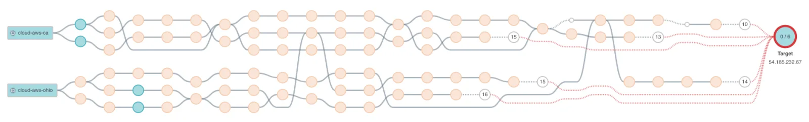

# TODOS

- Tunnel Interface
- Web Rendering vs CURL for CSR and SSR
- Results visualiser tool for json parsing / Table View
- File Upload speed
- Filetypes w/ integrity checking - pdf, binaries (exe and more), jpeg, text file vs zip
- Make sure ot handle partial file downloads and subeuent fairlure flags etc
- Ping for the RP's digged static IP as well!

- ICMP as well as TCP traceroute
- pcaps offsite
- pcaps analysis for packet loss
- Nmap the URL
- Uptime Kuma

<!-- IN my network measurments testing script here, add a few things.

Let it be able to handle partial file downloads. I am referring to the curl fiel downlaods that happen N times every run! Basically even if here is an rerror you incldue that as an infrimation point in the results, what haooened how muh was downlaoded etc! THis could eman anythgin form having top level boolean flags o additional data points in th final report json! Because theres a hgih changce of being blocked or rate limited and i dont want that to interrup a run. At th every top level also have a flag for allsuccess that means everything went smoothly. 

Instead of downloading just a buffer file, let use download files by type! - Filetypes w/ integrity checking - pdf, binaries (exe and more), jpeg, normal vs zip

DO ICMP as well as TCP traceroute

Remove the pcap librayr and its use! At the start of each run you start tcp dump and then at the end you end it andy ou save that alongisde the results (lets have a flag t keep pcaps on or off)

Ping to the static IP/s that you get after doing dig on the tunnel domain! Keep the results of that too.Also have a structured otput for all the pings! Maybe just the final resultant statsitics like 15 packets transmitted, 15 received, 0% packet loss, time 14020ms
rtt min/avg/max/mdev = 21.684/23.205/28.113/1.709 ms can be parsed!

For the web tests you will do curl vs web rendering of the /csr and /ssr route from the server and compare the timing. Make an interfae for this, forget about th exact implmentation for now (i willl use playwright)

We have N number of file downloads but lets also do filee uploads! I want to see uload speed as well

Lets do an nma of th edomain also! Add that as a CLI tool and do the whole shebag that was doen witht he rest of them (parsed and unparsed) -->

I'll break down each of the requested improvements and provide suggestions for implementation. I'll think through each point carefully to provide the best advice for your network measurements study.

1. Handling Partial File Downloads:
To handle partial file downloads during the curl operations, we should modify the download function to capture and record partial download information. This could involve:

- Implementing a try-catch block around the curl download operation
- Recording the amount of data downloaded before an error occurs
- Adding fields to the results JSON for partial download information (e.g., bytes_downloaded, download_status)
- Creating a top-level boolean flag like "all_downloads_complete" in the final report

Suggestion: Consider using curl's built-in resume functionality (`-C -`) to attempt resuming interrupted downloads, which could provide more complete data for your study.

2. Downloading Different File Types with Integrity Checking:
To download various file types and perform integrity checks, we should:

- Create a list of file types to download (PDF, EXE, JPEG, ZIP, etc.)
- Implement integrity checking methods for each file type (e.g., checksum verification)
- Add fields in the results JSON for each file type's download status and integrity check result

Suggestion: Use libraries specific to each file type for robust integrity checking (e.g., PyPDF2 for PDFs, PIL for images).

3. ICMP and TCP Traceroute:
To implement both ICMP and TCP traceroute:

- Add a function to perform ICMP traceroute (you can use the `scapy` library for this)
- Modify the existing TCP traceroute function if necessary
- Store results from both traceroute methods in the final report

Suggestion: Consider using `paris-traceroute` for more accurate results in the presence of load balancers.

4. Replacing PCAP with tcpdump:
To replace the PCAP library with tcpdump:

- Remove all PCAP-related code
- Implement a function to start tcpdump at the beginning of each run
- Create a function to stop tcpdump and save the capture file alongside the results
- Add a flag to enable/disable PCAP capture

Suggestion: Use subprocess to run tcpdump commands and consider implementing rotation of capture files for long-running tests.

5. Pinging Static IPs:
To ping static IPs resolved from the tunnel domain:

- Implement a function to perform `dig` on the tunnel domain and extract IP addresses
- Create a ping function that accepts an IP address and returns structured results
- Parse the ping output to extract statistics (packets transmitted, received, loss percentage, RTT min/avg/max/mdev)
- Store these results in the final report JSON

Suggestion: Consider using the `ping3` Python library for more precise control over the ping process.

6. Web Tests (curl vs. web rendering):
For comparing curl and web rendering performance:

- Implement a function to measure curl performance for /csr and /ssr routes
- Create an interface for web rendering timing (to be implemented later with Playwright)
- Store timing results for both methods in the final report

Suggestion: Consider implementing a simple headless browser solution (e.g., using `requests-html`) as a placeholder until you implement Playwright.

7. File Uploads:
To add file upload tests:

- Create a set of files with varying sizes for upload testing
- Implement an upload function using `requests` or `curl`
- Measure and record upload speeds for each file
- Add upload results to the final report JSON

Suggestion: Consider testing with different chunk sizes for uploads to analyze their impact on performance.

8. Nmap Domain Scanning:
To incorporate Nmap scanning:

- Implement a function to run Nmap scans on the target domain
- Parse the Nmap output and store both raw and parsed results
- Add Nmap results to the final report JSON
- Create a CLI option to enable/disable Nmap scanning

Suggestion: Use the `python-nmap` library for easier integration and parsing of Nmap results.

Additional Suggestions:
1. Error Handling: Implement robust error handling throughout the script to ensure that a failure in one component doesn't stop the entire test run.
2. Logging: Add detailed logging to help with debugging and to provide more context for the test results.
3. Configurability: Make the script highly configurable, allowing users to easily enable/disable specific tests or adjust parameters.
4. Rate Limiting: Implement intelligent rate limiting and backoff strategies to minimize the chance of being blocked during long test runs.
5. Data Visualization: Consider adding a component to generate visualizations of the test results, which could be valuable for your IMC paper.

These improvements will significantly enhance your network measurement testbed. Remember to thoroughly test each new feature and consider the ethical implications of your scanning and testing activities, especially when implementing features like Nmap scanning.

---
UI ideas

# TODOS
- clean up wg-quick process

TODO
- 530 status pcap check
- Node.js factors / server side status code checks
- paris traceroute no need

Analysis Scripts 
- http status codes per tool

Save curl files

Add hash comparisons as well as filesize checks

Record notes on free vs paid experience (tool by tool setup)

Playwright vs Selenium for browser testing (good reasons)

Graphs - ttfb download time throughput

Classification Table

Setup time system side as well as just server side

What is an efficient way toget TTFB (current curl formula may not be it)

Exact numbers for what is what, how many each category

Preliminary graphs

COUNTS

---

STATS

Total List: 85
Working: 20
Limitless: 
Gateway tools: